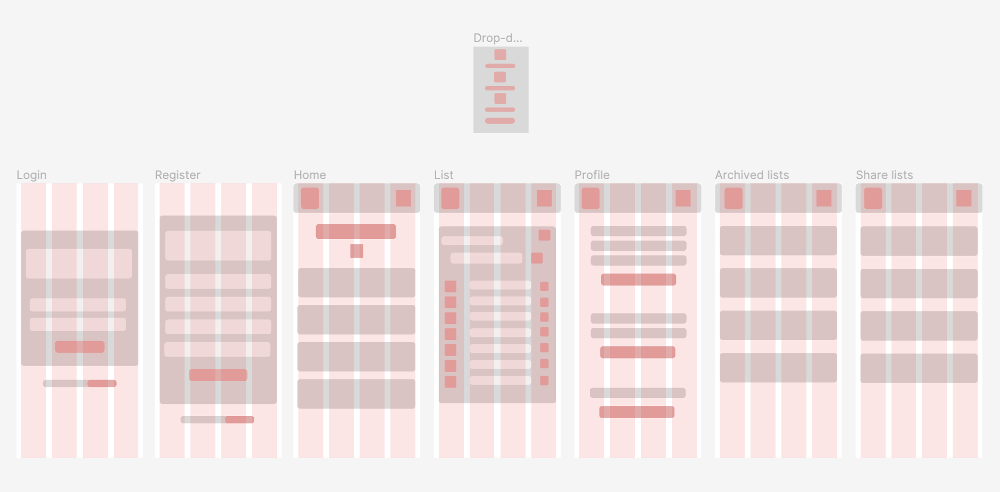

# Mind Free App

## Intro
Quickly write down everything that comes to mind.

Mind Free is the best place to jot down quick thoughts.

It allows you to create your own custom lists and share them with your friends and family.
Whether you want to increase your productivity, lower your stress levels, or free up some mental space, My Lists will help you manage your life:

- Register your ideas
- Create custom lists
- Share lists with your friends and family with real-time synchronization

## Functional

### Use cases

User

- Create list
- View list
- Update list
- Delete list
- Share list
- View lists
- Search lists by title
- Archive list
- Dearchive list
- View archived lists

#### UI design

Mobile

## Techincal

### Data model

User

- id
- name (string, required)
- age (number, required)
- email (string, required, unique)
- password (string, required, length >= 8)

List

- id
- title (string, required)
- items (array of Item)
- archived (boolean, required)
- shareds (array of Shared)

Item

- id
- text (string, required)
- checked (boolean, required)

Shared

- id
- mode (string, enum ['viewer', 'editor'], required)

