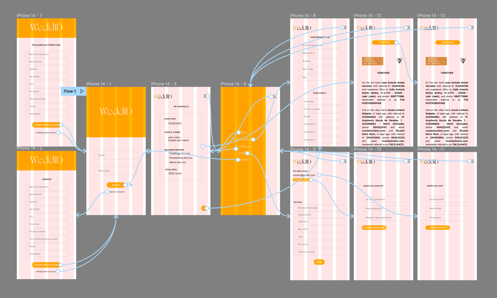

# WeddID

## Intro

Send your contracts and keep your customer data up to date to save time and be more productive.

The app allows you to send a form to your clients to register and send their personal data, along with the data, places and time of the event. They can also select the services they need to hire.

The app will work for you, since it collects all the data and incorporates them into your contract, so that customers can visualize it before their signature. If you agree, you will only have to download the contract in PDF format and sign it.

## Functional

### Use cases

Admin

- Add client
- View clients
- Search client
- Update client
- Add contract
- View contract
- Search contract
- Update contract
- Remove contract

Client

- Save personal data
- View personal data
- Modify personal data
- Recieve contract
- View constracts
- Create pdf contract

#### UI design

Mobile

## Technical

### Data model

User

- id
- name (string, required)
- nationalId (string, required)
- role (string, required, enum ['photographer', 'particular'])
- address (string, required)
- zipCode (string, required)
- city (string, required)
- province (string, required)
- phone (string, required)
- photographer (string)
- email (string, required, unique)
- password (string, required, length >= 8)

Contract

- id
- user (user.id)
- date (Date, required)
- description (string, required)
- price (number, required)

- eventDate (date, required)
- ceremonyPlace (Place, required)
- sessionPlace (Place)
- celebrationPlace (Place)
- preparationPlace (Place)

- coupleName (string, required)
- coupleId (string, required)
- couplePhone (string)
- coupleEmail (string, required, unique)
- couplePreparationPlace (Place)

Place

- id
- description (string, required)
- address (string)
- zipCode (string)
- city (string, required)
- province (string)

Services

- id
- name (string, required)
- price (number, required)
