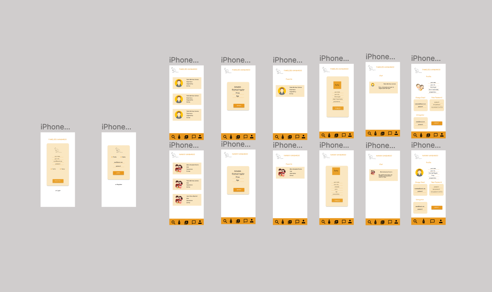
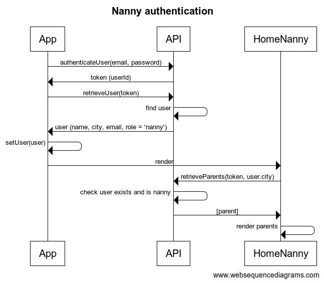
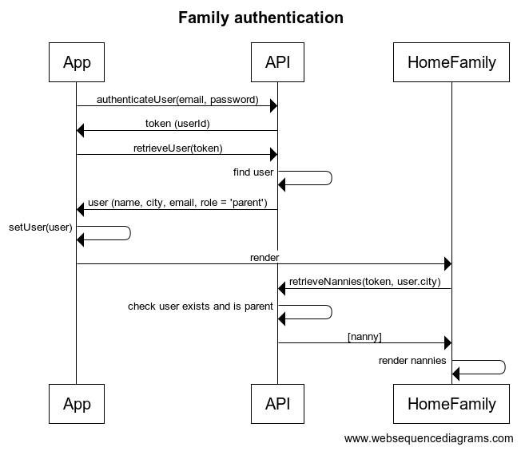

# KANGAROO

## Intro

This project seeks to connect families and nannies. It looks for family and nannies in the same town and connects them together. Family and nannies are connected together with the chat in real time. And could do a more specific search for family and nannies.

## Funcional

### Use cases

Parents

- Look for nannys
- Mark favorites
- Search by price
- Search by availability
- Send message

Nannies

- Look for family
- Mark favorites
- Search by price
- Search by availability
- Send message

Chat 
-Send message to family
- Send message to nanny

### UI design

Mobile

## Technical

### Data Model

User
- id
- email (string, required, unique)
- password (string, required, length >= 8)
- role (string, enum ['parent', 'nanny'], required)
- name (string, required)
- city (string, required)

Parent
- id
- user (user.id)
- description (string, required)
- kids (array of Kid)
- availabilities (array of Abailability)
- extras (string, required)

Kid
- id
- name (string, required)
- dateOfBirth (date, required)

Nanny
- id
- user (user.id)
- description (string, required)
- experience (string, required)
- dateOfBirth (date, required)
- price (number, required)
- availabilities (array of Abailability)
- extras (string)

Availability
- id
- day (string, required, enum ['Sunday', 'Monday', 'Tuesday', 'Wednesday', 'Thursday', 'Friday', 'Saturday'])
- times (array of string, required, enum ['Morning', 'Afternoon','Night'])

Chat
- id
- users (array of user.id)
- messages (array of Message)

Message
- id
- user (user.id)
- message (string, required)
- date (date, required)

### Sequences

